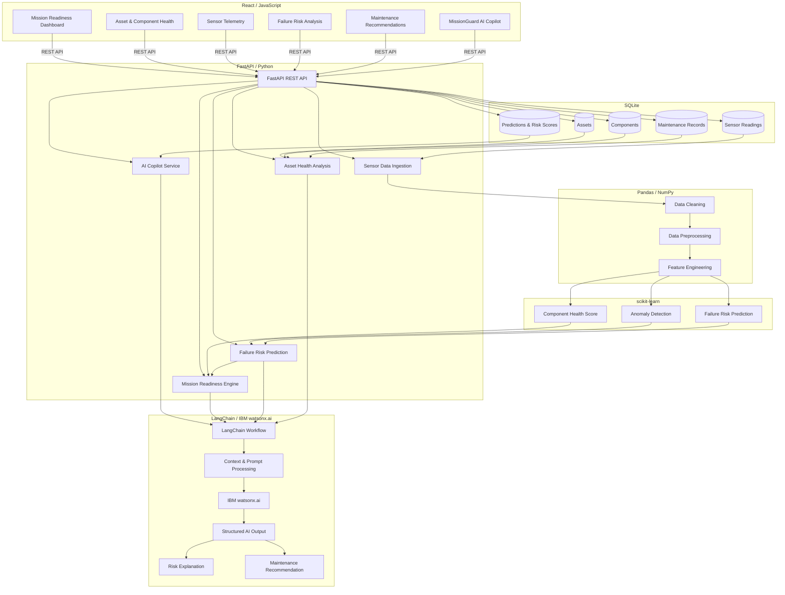

# Architecture

## System Architecture

# MissionGuard — System Architecture

## Components

| Component | Technology | Responsibility |
|---|---|---|
| Frontend | React / JavaScript | Mission readiness dashboard, sensor visualization, risk status, maintenance recommendations, AI Copilot interface |
| Backend API | FastAPI / Python | API endpoints, data processing orchestration, readiness assessment, ML integration, Copilot integration |
| Data Processing | Pandas / NumPy | Cleaning, preprocessing, transformation, and feature engineering of sensor and maintenance data |
| AI / ML | scikit-learn | Sensor anomaly detection, component health scoring, and failure-risk prediction |
| AI Orchestration | LangChain | Connecting asset data, ML results, prompts, and the AI Copilot workflow |
| LLM | IBM watsonx.ai | Natural-language reasoning, risk explanation, and maintenance recommendation generation |
| Database | SQLite | Storing asset information, sensor readings, component data, maintenance records, and prediction results |
| Development | IBM Bob | AI-assisted development, code generation, debugging, and development workflow |
| Version Control | Git / GitHub | Source-code version control and project submission |

## Data Flow

1. Sensor telemetry and historical maintenance records are provided to the FastAPI backend.
2. Pandas and NumPy clean, preprocess, and transform the incoming sensor and maintenance data.
3. Processed sensor data is passed to scikit-learn models for anomaly detection, component health scoring, and failure-risk prediction.
4. The resulting anomaly indicators and failure-risk scores are combined by the Mission Readiness Engine to classify the asset as Ready, At Risk, or Not Mission Ready.
5. The asset condition, ML results, and relevant maintenance history are passed to a LangChain workflow.
6. LangChain prepares the relevant context and prompt for IBM watsonx.ai.
7. IBM watsonx.ai generates a natural-language explanation of the identified risk and recommends prioritized maintenance actions.
8. Asset data, sensor readings, maintenance records, and prediction results are stored in SQLite.
9. FastAPI exposes the processed results to the React frontend.
10. The React dashboard displays mission readiness, sensor anomalies, failure risks, explanations, and prioritized maintenance recommendations.

## Security Considerations

- API credentials and IBM watsonx.ai credentials are stored in environment variables and are never committed to GitHub.
- Sensitive configuration values are excluded from version control using `.gitignore`.
- Backend API access is separated from frontend presentation through FastAPI endpoints.
- Input data is validated before being processed by the backend and ML pipeline.
- The prototype does not use real classified military data or operational military telemetry.

## Scalability Notes

The hackathon prototype uses SQLite and a single FastAPI backend for simplicity. For production deployment, the database could be migrated to a scalable relational database, FastAPI services could be horizontally scaled, and sensor ingestion and ML inference could be separated into independent services. The ML pipeline could also be optimized for high-volume streaming telemetry, while LangChain and watsonx.ai requests could use asynchronous processing and caching to handle larger workloads.