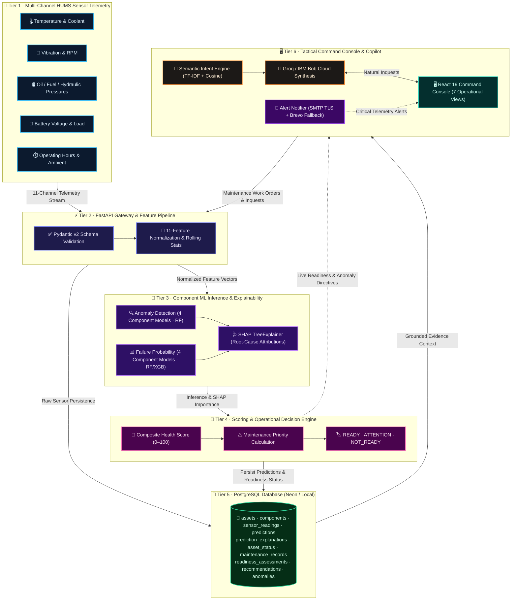

# 🏛️ SentinelAI — System Architecture

> **Technical Architecture, Data Flow, and Component Design for the Mission Readiness & Predictive Maintenance Copilot**

---

## 📐 System Architecture Diagram



---

## 🧩 Core System Components

| Layer | Technology | Key Responsibility |
|---|---|---|
| **Command Frontend** | React 19, Vite 8, Lucide React, Oxlint, Vanilla CSS / Tokens | High-contrast tactical command console featuring 7 dedicated views (`Overview`, `Fleet Assets`, `Predictions`, `Trends & Health`, `AI Copilot`, `Reports`, `Settings`) plus drill-down `Asset Inspection` and `Component Analysis`. |
| **Backend REST API** | FastAPI, Uvicorn, Pydantic v2, SQLAlchemy 2.0 | Asynchronous REST service exposing operational endpoints (`/assets`, `/components`, `/telemetry`, `/predictions`, `/anomalies`, `/dashboard`, `/maintenance`, `/command`, `/copilot`, `/chat`, `/auth`). |
| **Machine Learning** | Scikit-learn, XGBoost, SHAP (`TreeExplainer`), Pickle | In-memory `ModelRegistry` serving 8 serialized `.pkl` pipelines for 4 critical components (Engine, Battery, Fuel Pump, Hydraulic System) across anomaly detection and failure probability. |
| **Operational Copilot** | Scikit-learn TF-IDF, Groq API, IBM Bob API | Hybrid conversational copilot with multi-pattern entity extraction (`A021`, `Platform 21`), defense abbreviation expansion (`FMC`, `NMC`, `RUL`), typo tolerance, 15 intent categories, and strict out-of-domain refusal. |
| **Database & ORM** | PostgreSQL 14+ / Neon Serverless PostgreSQL, SQLAlchemy 2.0, Alembic | Relational persistence for asset registries, 20,000+ sensor records, anomaly logs, prediction explanations, trend analyses, and maintenance records. |
| **Defense Notification Engine** | SMTP (TLS), Brevo API Fallback, Python `smtplib` | Dual-channel alerting service (`alert_notifier.py`) strictly enforcing static recipient whitelisting (`sentinelai712@gmail.com`) for anomaly alerts and fleet readiness summaries. |

---

## 🔄 End-to-End Operational Data Flow

```
[ 📡 Sensor Telemetry ] ➔ [ 🧠 8 ML Models & SHAP ] ➔ [ 🚦 Readiness & Health Scoring ] ➔ [ 🔧 Maintenance Orders ] ➔ [ 💬 Grounded Copilot ]
```

1. **Telemetry Ingestion:** 11-channel multi-sensor readings (temperature, vibration, oil pressure, fuel pressure, RPM, hydraulic pressure, battery voltage, coolant temperature, operating hours, load percentage, ambient temperature) are ingested and validated via `/api/v1/telemetry`.
2. **Feature Processing & In-Memory ML Inference:** Telemetry is processed by the feature pipeline (calculating rolling statistics, rate-of-change, and normalization) and evaluated against the component's designated pipeline in `ModelRegistry`:
   - **Anomaly Detection:** Pipeline (StandardScaler + SimpleImputer + RandomForestClassifier) identifies out-of-distribution telemetry patterns.
   - **Failure Probability:** Pipeline (ColumnTransformer + RandomForestClassifier or XGBClassifier) predicts 50-hour failure risk.
   - **SHAP Feature Attribution:** `TreeExplainer` computes exact contribution values and ranks the primary and secondary contributing sensors.
3. **Deterministic Readiness Scoring:** `ScoringService` calculates operational metrics:
   - **Anomaly Severity:** Clamped probability score ($0–100$).
   - **Trend Risk:** Multi-factor trend evaluation incorporating rate-of-change, persistence, and multi-sensor drift ($0–100$).
   - **Health Score:** $100 - (0.50 \times \text{FailureRisk}) - (0.30 \times \text{AnomalySeverity}) - (0.20 \times \text{TrendRisk})$.
   - **Maintenance Priority:** $(0.60 \times \text{FailureRisk}) + (0.25 \times \text{AnomalySeverity}) + (0.15 \times \text{TrendRisk})$ classified into `CRITICAL` ($\ge 80$), `HIGH` ($60–79$), `MEDIUM` ($40–59$), or `LOW` ($< 40$).
   - **Asset Operational Status:** Calculated across all 4 components into `READY`, `ATTENTION` (multiple high-priority or anomalous components), or `NOT_READY` (any critical component).
4. **Maintenance Planning:** Prescriptive recommendations are linked directly to affected subsystems with standardized diagnostic check procedures.
5. **Commander Copilot Inquest:** The `SemanticUnderstandingEngine` routes questions across 15 intent categories, queries PostgreSQL for real-time telemetry and component condition, and synthesizes structured answers via Groq (`openai/gpt-oss-120b`) or IBM Bob (`ibm/granite-3-8b-instruct`), refusing non-platform queries.
6. **Closed-Loop Reassessment:** When maintenance work orders are completed, SentinelAI executes immediate reassessment on updated telemetry to mathematically verify component normalization before clearing the asset.

---

## 🗄️ Database Schema Overview (PostgreSQL)

| Table Name | Primary Entity | Primary Function |
|---|:---:|---|
| `assets` | `Asset` | Fleet equipment registry (asset ID, name, classification, status, creation timestamp). |
| `components` | `Component` | Subsystem registry for each asset (`Engine`, `Battery`, `Fuel Pump`, `Hydraulic System`). |
| `sensor_readings` | `SensorReading` | Chronological multi-channel HUMS telemetry records (11 physical parameters). |
| `anomalies` | `Anomaly` | Detected anomaly events with anomaly score, severity tier, and affected sensors. |
| `predictions` | `Prediction` | Inference records storing failure probability, health score, trend risk, and priority level. |
| `prediction_explanations` | `PredictionExplanation` | SHAP feature attributions, contribution directions, and relative importance ranks. |
| `trend_analysis` | `TrendAnalysis` | Sensor time-series trend evaluations and multi-sensor degradation metrics. |
| `asset_status` | `AssetStatus` | Overall asset operational readiness (`READY`, `ATTENTION`, `NOT_READY`) and component severity counts. |
| `maintenance_records` | `MaintenanceRecord` | Logged maintenance actions, issues detected, parts replaced, and maintenance status. |
| `readiness_assessments` | `ReadinessAssessment` | Historical multi-factor readiness assessments, risk factors, and contributing reasons. |
| `recommendations` | `Recommendation` | Actionable maintenance recommendations prioritized by urgency (`CRITICAL` to `LOW`). |

---

## 🔒 Security & Reliability

- **Single-Administrator Authentication:** Access is secured via bcrypt password verification against configured server secrets (`ADMIN_EMAIL` and `ADMIN_PASSWORD_HASH`), issuing signed HS256 JWT tokens via HTTP-Only session cookies (`sentinel_session`) and `Authorization: Bearer` headers.
- **Strict Out-of-Domain Copilot Boundary:** The conversational engine actively inspects incoming queries and rejects unrelated general topics (jokes, weather, trivia, entertainment) with an explicit SentinelAI defense scope disclaimer.
- **Defense-Grade Notification Whitelisting:** Outbound notifications via SMTP TLS or Brevo API enforce an immutable recipient whitelist (`sentinelai712@gmail.com`), rejecting unapproved target addresses before socket initialization.
- **Zero-Hallucination Grounding:** Inquests retrieve live database records, sensor thresholds, and SHAP feature importances, preventing fabricated readiness metrics or hallucinated telemetry.
- **Automated Verification:** The backend and copilot semantic paraphrase engines are verified by **154/154 passing automated pytest tests**.