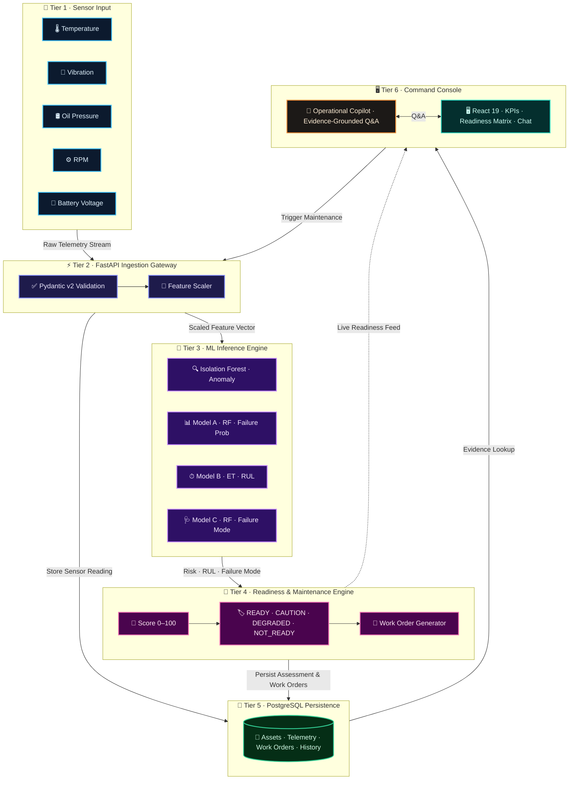

# 🏛️ SentinelAI — System Architecture

> **Technical Architecture, Data Flow, and Component Design for the Mission Readiness & Predictive Maintenance Copilot**

---

## 📐 System Architecture Diagram



---

## 🧩 Core System Components

| Layer | Technology | Key Responsibility |
|---|---|---|
| **Command Frontend** | React 19, Vite, Lucide Icons | Responsive command console, fleet KPI cards, interactive 4-tier readiness matrix, sensor graphs, and natural-language query interface. |
| **Backend REST API** | FastAPI, Uvicorn, Pydantic v2 | High-performance asynchronous API router, request validation, authentication, and core domain orchestration. |
| **Machine Learning** | Scikit-learn, NumPy, Pandas, Joblib | Production inference hierarchy loaded into memory on server boot (`ModelRegistry`): failure probability, RUL regression, failure mode, and anomaly detection. |
| **Database & ORM** | PostgreSQL 14+, SQLAlchemy 2.0, Alembic | Relational persistence for asset registries, 20,000+ sensor records, anomaly logs, readiness histories, and work orders with automated migrations. |
| **Model Development** | IBM Bob | Accelerated ML model development, feature selection, data leakage audits, model training, and performance evaluation. |

---

## 🔄 End-to-End Operational Data Flow

```
[ 📡 Sensor Telemetry ] ➔ [ 🧠 Scaler & 4 ML Models ] ➔ [ 🚦 4-Tier Readiness ] ➔ [ 🔧 Actionable Work Orders ] ➔ [ 💬 Grounded Copilot ]
```

1. **Telemetry Ingestion:** Multi-sensor readings (vibration, heat, hydraulic pressure, oil pressure, fuel pressure, RPM, battery voltage) are ingested via `/api/v1/telemetry`.
2. **In-Memory ML Inference:** The input vector is scaled and evaluated across all 4 production models in sub-milliseconds:
   - **Isolation Forest:** Checks for telemetry anomalies and sensor drift.
   - **Model A (Random Forest):** Predicts 50-hour failure probability $[0.0, 1.0]$.
   - **Model B (Extra Trees):** Estimates Remaining Useful Life (RUL) in operational hours.
   - **Model C (Multiclass RF):** Diagnoses specific failure mode (e.g., pressure drop, bearing wear, overheating).
3. **Deterministic Readiness Scoring:** The `ReadinessAssessmentEngine` calculates an explainable 0–100 score and assigns a readiness tier:
   - 🟢 **`READY`**: Failure probability $< 30\%$, RUL $> 50$ hrs, 0 critical anomalies.
   - 🟡 **`CAUTION`**: Failure probability $30\% - 50\%$, RUL $35 - 50$ hrs, minor drift.
   - 🟠 **`DEGRADED`**: Failure probability $50\% - 75\%$, RUL $15 - 35$ hrs, high risk.
   - 🔴 **`NOT_READY`**: Failure probability $\ge 75\%$, RUL $< 15$ hrs, or active failure. **Asset Grounded**.
4. **Maintenance Planning:** The `MaintenancePlanningEngine` creates prioritized, deduplicated interventions (`CRITICAL`, `HIGH`, `MEDIUM`, `LOW`) linked to specific target components.
5. **Commander Copilot Inquest:** The `OperationalCopilotEngine` translates commander questions into structured, evidence-backed answers citing exact sensor numbers and readiness reasons.
6. **Closed-Loop Reassessment:** Once maintenance is performed, SentinelAI runs immediate post-service validation to verify sensor readings normalized before restoring an asset to `READY`.

---

## 🗄️ Database Schema Overview (PostgreSQL)

| Table Name | Records in System | Primary Function |
|---|:---:|---|
| `assets` | 50+ | Fleet equipment registry (asset ID, model, base, operational status). |
| `sensor_readings` | 20,000+ | High-frequency multi-channel HUMS telemetry time-series. |
| `anomalies` | 5,000+ | Logged outlier events flagged by the Isolation Forest engine. |
| `predictions` | 100+ | Logged ML inference runs (failure probability, RUL hours, diagnosed mode). |
| `readiness_assessments` | 80+ | Historical readiness states (tier, composite score, risk factors). |
| `maintenance_records` | 300+ | Logged service histories, completed repairs, and maintenance duration. |
| `recommendations` | 250+ | Active, deduplicated work orders prioritized by urgency. |

---

## 🔒 Security & Reliability

- **Zero-Hallucination Architecture:** The Copilot answers strictly from database-backed records and exact sensor thresholds. It never invents readiness states.
- **Environment Isolation:** Secrets and database credentials stay confined to `.env` files and are never committed to version control.
- **Data Integrity & Boundary Validation:** Telemetry inputs are validated against physical engineering limits before reaching ML models or database storage.
- **Platform Scope & Fleet Boundary:** Due to distinct mechanical degradation curves and sensor feature schemas, the ML inference models and feature scalers are calibrated for a single fleet type (tactical aircraft/combat vehicle platform). Multi-platform heterogeneous fleets require platform-specific schema mapping and model retraining.
- **Automated Verification:** The entire backend, ingestion pipeline, ML inference registry, and readiness engine are validated with **45/45 passing automated pytest tests**.