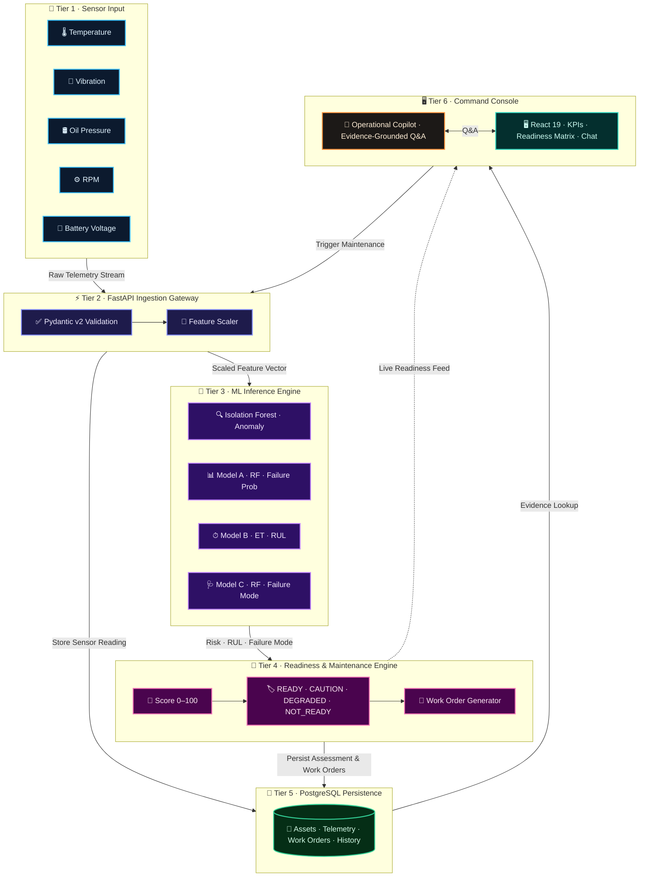

# 🛡️ SentinelAI — Solution Overview

> **Autonomous Mission Readiness & Predictive Maintenance Copilot for Defense Fleets**

---

## 💡 What We Built

In military aviation and fleet operations, maintenance typically suffers from a critical flaw: **it happens either too early (wasting budget and grounding healthy equipment) or too late (causing dangerous in-flight failures).**

**SentinelAI** solves this by turning raw equipment telemetry into proactive mission readiness. It monitors real-time sensors (temperature, vibration, pressure, RPM, voltage), predicts mechanical failures up to 50 hours in advance, calculates remaining flight life, and gives commanders instant, evidence-backed answers on which assets are safe to fly.

---

### ⚔️ Previous Traditional System vs. SentinelAI Copilot

| Capability | ❌ Previous Traditional System | 🛡️ Our SentinelAI System |
|---|---|---|
| **Maintenance Trigger** | Fixed calendar days or after equipment breaks down | Condition-based: triggered by real sensor wear & early trends |
| **Failure Warning** | None — surprise failures occur mid-sortie | Predicts component failure risk up to 50 operating hours ahead |
| **Readiness Visibility** | Basic binary flag: "Available" or "Grounded" | 4-Tier Nuanced Scale: `READY`, `CAUTION`, `DEGRADED`, `NOT_READY` |
| **Decision Making** | Hours spent reviewing manual paperwork & logs | Instant natural-language answers backed by sensor evidence |
| **Post-Repair Check** | Assumed ready as soon as paperwork is signed | Closed-loop: re-tests sensor telemetry before clearing flight |

---

## ⚡ How It Works

SentinelAI operates through an end-to-end, 5-stage closed-loop pipeline:

```
[ 📡 Sensor Streams ] ➔ [ 🧠 4 ML Models ] ➔ [ 🚦 4-Tier Readiness ] ➔ [ 🔧 Work Orders ] ➔ [ ✅ Verified Recovery ]
```

1. **📡 Real-Time Telemetry Ingestion**  
   Continuously ingests multi-channel sensor feeds (vibration, heat, hydraulic pressure, oil pressure, fuel pressure, RPM, battery voltage).

2. **🧠 Multi-Model AI Inferences**  
   Incoming data simultaneously runs through 4 specialized machine learning models:
   - **Anomaly Engine** (*Isolation Forest*): Detects abnormal sensor patterns and telemetry outliers.
   - **Failure Probability** (*Random Forest*): Calculates the likelihood of component breakdown within 50 operating hours.
   - **Remaining Useful Life** (*Extra Trees Regressor*): Forecasts exact remaining operating hours ($0$ to $100+$ hrs).
   - **Root-Cause Diagnosis** (*Multiclass Classifier*): Identifies the exact failing subsystem (e.g., fuel pump, bearing wear, pressure loss).

3. **🚦 4-Tier Mission Readiness Scoring**  
   Translates complex ML predictions into clear operational flight readiness:
   - 🟢 **READY (Score 80–100):** Healthy sensors. Cleared for unrestricted combat sorties.
   - 🟡 **CAUTION (Score 60–79):** Minor telemetry drift. Cleared for secondary or training missions.
   - 🟠 **DEGRADED (Score 40–59):** Elevated failure risk. Restricted operations; maintenance pre-staged.
   - 🔴 **NOT_READY (Score 0–39):** Critical failure risk or low RUL. **Grounded immediately** for repairs.

4. **🔧 Prioritized Action Plans**  
   Automatically compiles deduplicated, ranked maintenance work orders (`CRITICAL` to `LOW` urgency) detailing the exact target component and required fix.

5. **🔄 Closed-Loop Reassessment**  
   When maintenance is marked complete, SentinelAI runs a fresh telemetry check to mathematically verify that sensor readings have normalized before returning the asset to `READY` status.

---

## 🏛️ Architecture Diagram

> See [`architecture.md`](architecture.md) for complete database schema and API documentation.



---

## 🎯 Key Design Decisions

> [!NOTE]
> **Why Deterministic Evidence Over Open-Ended Chat?**  
> In military operations, an AI that hallucinates or guesses can cost lives. Our Copilot answers commander questions using verifiable database telemetry and exact threshold citations—delivering reliable, audit-ready intelligence.

- **Zero-Latency In-Memory Models:** All 4 trained ML models load into FastAPI memory on startup (`ModelRegistry`), providing instant predictions without external API latency.
- **Evidence-Backed Answers:** When the Copilot explains an asset's risk, it provides exact telemetry citations (e.g., *"Hydraulic pressure dropped to 1,850 psi, failure probability 60.6%"*).
- **Strict Data Leakage Prevention:** Post-repair details and future dates were strictly excluded during ML training, guaranteeing that models predict failures purely from real-time sensor signatures.
- **Closed-Loop Verification:** Readiness status is tied directly to verified post-maintenance sensor health, preventing assets from being cleared prematurely.

---

## 🔵 IBM Technologies Used

### **IBM Bob — Machine Learning Model Development**
We used **IBM Bob** as our core AI development accelerator to:
- **Engineer & Tune the ML Pipeline:** Guided feature engineering across 20 sensor metrics and structured our 4-tier model hierarchy.
- **Model Training & Leakage Prevention:** Assisted in training, validating, and comparing candidate models (Random Forest, Extra Trees, Isolation Forest) to ensure zero data leakage.

---

## ⚠️ Known Limitations

- **Single Fleet / Platform Type Specialization** — Due to model complexity, divergent telemetry baselines, and limited multi-platform failure data, the predictive models and degradation curves are currently built and calibrated for a single fleet type (tactical aircraft/vehicle platform). Extending to heterogeneous vehicle or vessel classes requires platform-specific sensor schema mapping and dedicated model retraining.
- **Synthetic / Limited Sensor Data** — The prototype uses simulated or publicly available sensor telemetry rather than live operational defense feeds. Real predictive-maintenance datasets often exhibit scarce positive failure examples.
- **Predictive Scope vs. Combat Trauma** — The system is engineered to detect progressive mechanical fatigue and wear (thermal spikes, pressure drops, bearing degradation). It cannot anticipate sudden combat trauma, kinetic strikes, or structural failures that occur without prior telemetry warning.
- **Offline Retraining Boundary** — Runtime inference is instantaneous via an in-memory `ModelRegistry`, but model retraining and hyperparameter updates currently operate as an offline batch process.
- **Scoped Domain Querying (Not a General-Purpose Chatbot)** — The operational copilot is strictly grounded in defense fleet maintenance, telemetry, and readiness data. It does not answer general or unrelated questions outside supported fleet data.


