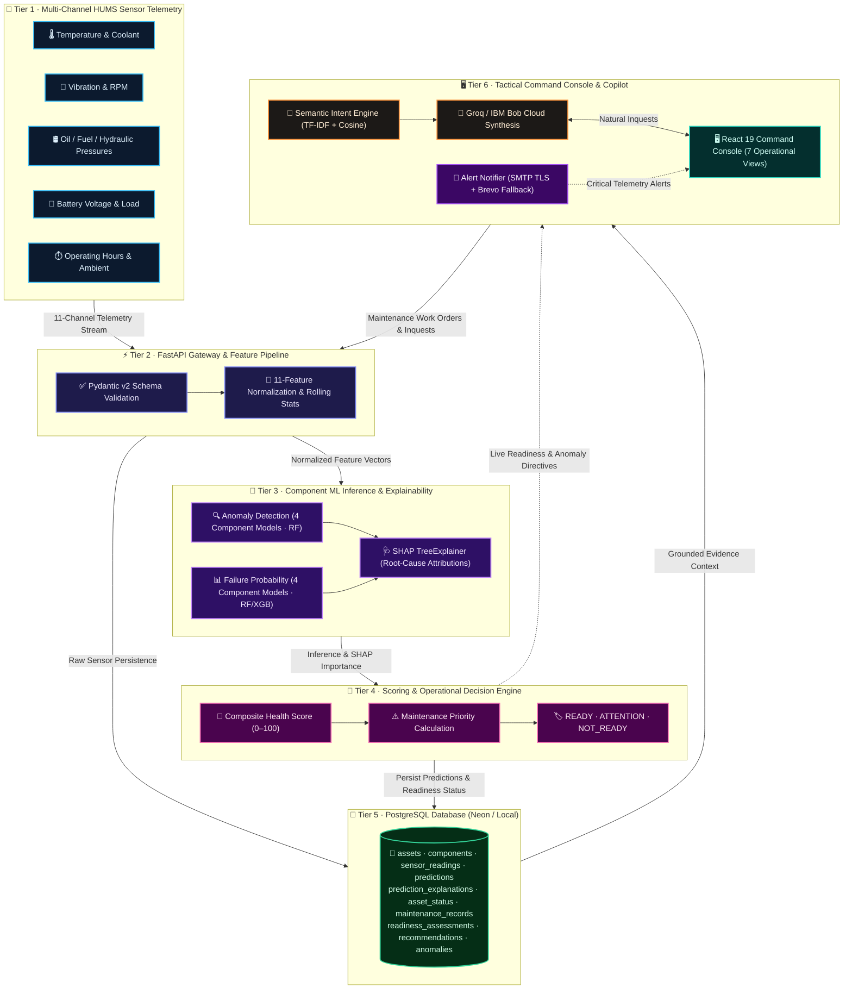

# 🛡️ SentinelAI — Solution Overview

> **Autonomous Mission Readiness & Predictive Maintenance Copilot for Defense Fleets**

---

## 💡 What We Built

In military aviation and fleet operations, maintenance typically suffers from a critical flaw: **it happens either too early (wasting budget and grounding healthy equipment) or too late (causing dangerous in-flight failures).**

**SentinelAI** solves this by turning raw equipment telemetry into proactive mission readiness. It monitors real-time sensors (temperature, vibration, pressures, RPM, voltage), predicts mechanical failures up to 50 hours in advance, isolates telemetry anomalies with SHAP feature attributions, and gives commanders instant, evidence-backed answers on which assets are safe to deploy.

---

### ⚔️ Previous Traditional System vs. SentinelAI Copilot

| Capability | ❌ Previous Traditional System | 🛡️ Our SentinelAI System |
|---|---|---|
| **Maintenance Trigger** | Fixed calendar days or after equipment breaks down | Condition-based: triggered by real sensor wear & early trends |
| **Failure Warning** | None — surprise failures occur mid-sortie | Predicts component failure risk up to 50 operating hours ahead |
| **Readiness Visibility** | Basic binary flag: "Available" or "Grounded" | Nuanced Scale: `READY`, `ATTENTION`, and `NOT_READY` with composite scores |
| **Decision Making** | Hours spent reviewing manual paperwork & logs | Instant natural-language answers backed by sensor evidence |
| **Post-Repair Check** | Assumed ready as soon as paperwork is signed | Closed-loop: re-tests sensor telemetry before clearing flight |

---

## ⚡ How It Works

SentinelAI operates through an end-to-end, 5-stage closed-loop pipeline:

```
[ 📡 Sensor Streams ] ➔ [ 🧠 8 Component ML Models & SHAP ] ➔ [ 🚦 Readiness & Health Scoring ] ➔ [ 🔧 Work Orders ] ➔ [ ✅ Verified Recovery ]
```

1. **📡 Real-Time Telemetry Ingestion**  
   Continuously ingests 11-channel multi-sensor feeds (temperature, vibration, oil pressure, fuel pressure, RPM, hydraulic pressure, battery voltage, coolant temperature, operating hours, load percentage, ambient temperature).

2. **🧠 Multi-Model AI Inferences & SHAP Attributions**  
   Incoming data simultaneously runs through 8 component-specific machine learning pipelines across 4 critical subsystems (Engine, Battery, Fuel Pump, Hydraulic System):
   - **Anomaly Detection Pipelines** (*Random Forest Classifiers*): Detects abnormal sensor patterns and multi-channel telemetry drift.
   - **Failure Probability Pipelines** (*Random Forest & XGBoost Classifiers*): Calculates the likelihood of breakdown within 50 operating hours.
   - **SHAP Feature Importance Engine** (*TreeExplainer*): Diagnoses the exact root-cause sensors driving risk (e.g., oil pressure drop, bearing vibration, thermal spikes).

3. **🚦 Operational Readiness & Health Scoring**  
   Translates complex ML predictions and trend risks into clear operational status:
   - 🟢 **READY (Score 80–100):** Nominal telemetry. All subsystems healthy; cleared for unrestricted deployment.
   - 🟡 **ATTENTION (Score 60–79):** Moderate telemetry drift or multiple high-priority components; pre-staged for technical inspection.
   - 🔴 **NOT_READY (Score 0–59):** Critical failure risk ($\ge 80$ priority) on any primary component. **Grounded immediately** for repairs.

4. **🔧 Prioritized Action Plans**  
   Automatically compiles deduplicated, ranked maintenance work orders (`CRITICAL` to `LOW` urgency) detailing the exact target component and standardized diagnostic procedures.

5. **🔄 Closed-Loop Reassessment**  
   When maintenance is marked complete, SentinelAI runs a fresh telemetry check to mathematically verify that sensor readings have normalized before returning the asset to `READY` status.

---

## 🏛️ Architecture Diagram

> See [`architecture.md`](architecture.md) for complete database schema and API documentation.



---

## 🎯 Key Design Decisions

> [!NOTE]
> **Why Deterministic Evidence Over Open-Ended Chat?**  
> In military operations, an AI that hallucinates or guesses can cost lives. Our Copilot answers commander questions using verifiable database telemetry and exact threshold citations—delivering reliable, audit-ready intelligence.

- **Zero-Latency In-Memory Models:** All 8 trained component models load into FastAPI memory on startup (`ModelRegistry`), providing instant predictions without external runtime overhead.
- **Evidence-Backed Answers:** When the Copilot explains an asset's risk, it provides exact telemetry citations (e.g., *"Engine oil pressure dropped to 42.1 psi, failure probability 78.4%"*).
- **Strict Data Leakage Prevention:** Post-repair details and future dates were strictly excluded during ML training, guaranteeing that models predict failures purely from real-time sensor signatures.
- **Closed-Loop Verification:** Readiness status is tied directly to verified post-maintenance sensor health, preventing assets from being cleared prematurely.
- **Out-of-Domain Protection:** Strict domain enforcement intercepts unrelated general queries (jokes, weather, trivia) and issues a concise SentinelAI platform scope notice.

---

## 🔵 IBM Technologies Used

### **IBM Bob — Machine Learning Model Development & LLM Synthesis**
We used **IBM Bob** as our core AI development accelerator to:
- **Engineer & Tune the ML Pipeline:** Guided feature engineering across 11 physical sensor channels, structured our 8-model component hierarchy, and calibrated SHAP TreeExplainer attributions.
- **Model Training & Leakage Prevention:** Assisted in training, validating, and comparing candidate models (Random Forest, XGBoost) to ensure zero data leakage.
- **Granite LLM Synthesis:** Powered grounded operational chat responses via the IBM Bob API (`ibm/granite-3-8b-instruct`), with Groq cloud inference integration.

---

## ⚠️ Known Limitations

- **Single Fleet / Platform Type Specialization** — Due to model complexity, divergent telemetry baselines, and limited multi-platform failure data, the predictive models and degradation curves are currently built and calibrated for a single fleet type (tactical aircraft/combat vehicle platform). Extending to heterogeneous vehicle or vessel classes requires platform-specific sensor schema mapping and dedicated model retraining.
- **Synthetic / Limited Sensor Data** — The prototype uses simulated or publicly available sensor telemetry rather than live operational defense feeds. Real predictive-maintenance datasets often exhibit scarce positive failure examples.
- **Predictive Scope vs. Combat Trauma** — The system is engineered to detect progressive mechanical fatigue and wear (thermal spikes, pressure drops, bearing degradation). It cannot anticipate sudden combat trauma, kinetic strikes, or structural failures that occur without prior telemetry warning.
- **Offline Retraining Boundary** — Runtime inference is instantaneous via an in-memory `ModelRegistry`, but model retraining and hyperparameter updates currently operate as an offline batch process.
- **Scoped Domain Querying (Not a General-Purpose Chatbot)** — The operational copilot is strictly grounded in defense fleet maintenance, telemetry, and readiness data. It explicitly refuses general or unrelated questions outside supported fleet data.


